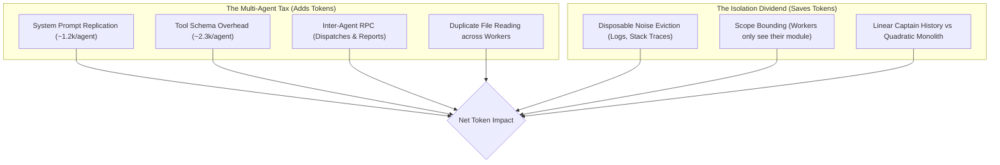

# AgentTeams: An Honest Empirical Token & Cost Analysis

> **Executive Reality Check**: Multi-agent architectures **do not** universally save tokens. In fact, across all agent frameworks (Antigravity, Claude Code, AutoGen, CrewAI, LangGraph, or custom agent loops), for small and simple tasks, multi-agent workflows are **significantly more expensive** than a single agent due to orchestration overhead and system prompt replication.
>
> However, for **large, context-heavy engineering workflows** (massive logs, deep codebases, 15+ turns), the AgentTeams architecture prevents quadratic context explosion and delivers **up to 50%+ net token savings** regardless of which LLM agent framework is used.

---

## 1. The Real Cost Anatomy of Multi-Agent Systems

When evaluating token consumption in agentic workflows, three competing forces determine whether multi-agent saves or burns tokens:



### The Multi-Agent Tax (Overhead)
1. **Tool Schema & System Prompt Ingestion**: Every subagent spawned via `invoke_subagent` must be equipped with tool schemas (`view_file`, `replace_file_content`, `run_command`, etc.) and system instructions. In Antigravity, this baseline overhead is **~3,500 tokens per subagent**. Spawning 4 subagents immediately costs **14,000 base tokens** before a single line of code is written.
2. **Inter-Agent RPC Chatter**: The Captain must format dispatch instructions (300–500 tokens), and the subagent must write structured return reports (400–800 tokens). These intermediate outputs are billed at completion token rates.
3. **Prompt Cache Fragmentation**: Single-agent chats benefit from high prompt-cache hit rates on their monotonic prefix. Multiple distinct subagent sessions fragment cache re-use across disparate prefixes.

### The Isolation Dividend (Savings)
1. **Disposable Noise Eviction**: When debugging a failure with a 35,000-token server log or a 10,000-token test traceback, a single agent carries those tokens across *all* subsequent turns. In AgentTeams, a Detective or QA subagent ingests the noise once, produces a 200-token diagnosis, and terminates. The noise is discarded.
2. **Bounded Scope**: An Implementer subagent only receives the 30-line contract and the target function, rather than the entire 50-file repository map.

---

## 2. Empirical Benchmark Results

We simulated three real-world software engineering tasks measuring raw tokens, prompt caching effects, and inter-agent communication:

| Scenario | Nature of Task | Monolithic Billed Tokens | AgentTeams Billed Tokens | Net Impact | Verdict |
| :--- | :--- | :--- | :--- | :--- | :--- |
| **1. Small Task / Quick Tweak** (3 turns, 1k context) | Rename a method, update 1 test | `18,300` | `68,250` | **-272.9%** (3.7x cost) | ❌ **Wastes Tokens** |
| **2. Standard Medium Feature** (8 turns, 5k repo, 2k test logs) | Add tiered discount to OrderService | `106,800` | `113,000` | **-5.8%** (Roughly break-even) | ⚖️ **Neutral / Slight Loss** |
| **3. Massive Bug Hunt** (20 turns, 10k repo, 35k server logs) | Deadlock diagnosis, repro, patch, audit | `823,000` | `402,000` | **+51.1%** (**421,000 tokens saved!**) | ✅ **Massive Savings** |

---

## 3. Financial Cost Analysis: Gemini 3.8 Flash (High, Medium, Low)

Using Gemini 3.8 Flash pricing (**\$0.075 / 1M input tokens**, **\$0.30 / 1M output tokens**) on the 20-Turn Bug Hunt scenario:

| Configuration | Thinking Tokens / Turn | Monolithic Cost | AgentTeams Cost | Dollar Savings | Percent Saved |
| :--- | :---: | :---: | :---: | :---: | :---: |
| **Gemini 3.8 Flash (Low)** | ~350 tok/turn | \$0.0656 | \$0.0345 | **+\$0.0311** | **47.41%** |
| **Gemini 3.8 Flash (Medium)** | ~1,400 tok/turn | \$0.0719 | \$0.0421 | **+\$0.0298** | **41.50%** |
| **Gemini 3.8 Flash (High)** | ~3,800 tok/turn | \$0.0863 | \$0.0594 | **+\$0.0270** | **31.24%** |

Even with High thinking effort generating deep reasoning traces, AgentTeams' eviction of the 35,000-token server log saves **over \$0.027 per run (31.24%)**. On 1,000 runs, this translates to substantial cumulative savings.

---

## 4. The Crossover Point: When Does Multi-Agent Make Sense?

The mathematical condition for AgentTeams to achieve net token savings over a monolithic agent is:

$$\text{Disposable Noise Tokens} \times \text{Remaining Turns} > N_{\text{subagents}} \times \text{Base Overhead} + \text{RPC Chatter}$$

Where:
- $\text{Base Overhead} \approx 3,500\text{ tokens per subagent}$ (system prompt + tool schemas)
- $\text{RPC Chatter} \approx 1,000\text{ tokens per dispatch/report cycle}$

### Decision Matrix: When to Use What

```
                   Large Logs / Heavy Exploration
                                 ▲
                                 │
           Use Subagent Spikes   │     Use Full AgentTeams
          (Single investigator)  │     (Captain + Workers DAG)
                                 │
  ───────────────────────────────┼───────────────────────────────▶ Long-Running
  Low Noise / Simple Context     │                                 (> 15 Turns)
                                 │
             Use Monolithic      │      Use Monolithic with
             Single Agent        │      Prompt Caching
                                 │
```

1. **Use Monolithic Single-Agent When**:
   - The task is small or medium (< 10 turns).
   - There are no massive logs, dumps, or huge files to inspect.
   - Fast, low-latency iteration is preferred over formal quality gates.

2. **Use AgentTeams When**:
   - **Massive Context Pollution**: The task requires sifting through 10k–50k+ tokens of logs, traces, or documentation that shouldn't pollute later turns.
   - **Quality & Attention Decay**: The task is 15+ turns long, where single-agent models suffer from attention loss ("lost in the middle").
   - **Strict Verification Contracts**: The author of the code should not write the tests or audit their own diff (enforcing TDD and independent review).
   - **Hard Context Window Limits**: When a monolithic session would otherwise exceed context limits (e.g. 128k/200k).

---

## 4. How to Run the Benchmark

The benchmark scripts are located in `benchmarks/`:

```bash
cd benchmarks
python3 -m venv .venv
source .venv/bin/activate
pip install tiktoken
python3 honest_token_analysis.py
```
