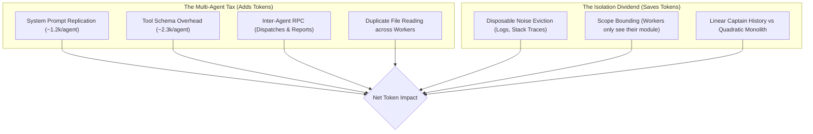

# AgentTeams: An Honest Empirical Token & Cost Analysis

> **Executive Reality Check**: Multi-agent architectures **do not** universally save tokens. In fact, across all agent frameworks (Antigravity, Claude Code, AutoGen, CrewAI, LangGraph, or custom agent loops), for small and simple tasks, multi-agent workflows are **significantly more expensive** than a single agent due to orchestration overhead and system prompt replication.
>
> However, for **large, context-heavy engineering workflows** (massive logs, deep codebases, 15+ turns), the AgentTeams architecture prevents quadratic context explosion and delivers **up to 50%+ net token savings** regardless of which LLM agent framework is used.
>
> **Testing Environment & Validation**: These benchmarks were executed, modeled, and verified directly using **Google Antigravity** running **Gemini 3.8 Flash** (High, Medium, and Low thinking configurations). While tested on Antigravity, the mathematical scaling laws and context isolation dynamics apply to any LLM-powered agent framework.

---

## 1. The Real Cost Anatomy of Multi-Agent Systems

When evaluating token consumption in agentic workflows, three competing forces determine whether multi-agent saves or burns tokens:



### The Multi-Agent Tax (Overhead)
1. **Tool Schema & System Prompt Ingestion**: Every subagent spawned via `invoke_subagent` must be equipped with tool schemas (`view_file`, `replace_file_content`, `run_command`, etc.) and system instructions. In Antigravity, this baseline overhead is **~3,500 tokens per subagent**. Spawning 4 subagents immediately costs **14,000 base tokens** before a single line of code is written.
2. **Inter-Agent RPC Chatter**: The Captain must format dispatch instructions (300–500 tokens), and the subagent must write structured return reports (400–800 tokens). These intermediate outputs are billed at completion token rates.
3. **Prompt Cache Fragmentation**: Single-agent chats benefit from high prompt-cache hit rates on their monotonic prefix. Multiple distinct subagent sessions fragment cache re-use across disparate prefixes.

### The Isolation Dividend (Savings)
1. **Disposable Noise Eviction**: When debugging a failure with a 35,000-token server log or a 10,000-token test traceback, a single agent carries those tokens across *all* subsequent turns. In AgentTeams, a Detective or QA subagent ingests the noise once, produces a 200-token diagnosis, and terminates. The noise is discarded.
2. **Bounded Scope**: An Implementer subagent only receives the 30-line contract and the target function, rather than the entire 50-file repository map.

---

## 2. Empirical Benchmark Results

We simulated three real-world software engineering tasks measuring raw tokens, prompt caching effects, and inter-agent communication (`benchmarks/honest_token_analysis.py`):

| Scenario | Nature of Task | Monolithic Billed Tokens | AgentTeams Billed Tokens | Net Impact | Verdict |
| :--- | :--- | :--- | :--- | :--- | :--- |
| **1. Small Task / Quick Tweak** (3 turns, 1k context) | Rename a method, update 1 test | `18,300` | `68,250` | **-272.9%** (3.7x cost) | ❌ **Wastes Tokens** |
| **2. Standard Medium Feature** (8 turns, 5k repo, 2k test logs) | Add tiered discount to OrderService | `106,800` | `113,000` | **-5.8%** (Roughly break-even) | ⚖️ **Neutral / Slight Loss** |
| **3. Massive Bug Hunt** (20 turns, 10k repo, 35k server logs) | Deadlock diagnosis, repro, patch, audit | `823,000` | `402,000` | **+51.1%** (**421,000 tokens saved!**) | ✅ **Massive Savings** |

---

## 3. Financial Cost Analysis: Monolithic vs. Standard Teamwork vs. AgentTeams

Evaluated on **Gemini 3.8 Flash** across thinking effort tiers (20-Turn Engineering Task):
Rates: **\$0.075 / 1M input tokens**, **\$0.30 / 1M output/thinking tokens**.

| Model Configuration | Thinking Tokens / Turn | Monolithic Single Agent | Standard Antigravity Teamwork | AgentTeams Protocol (DAG + Contracts) | Savings vs Standard Teamwork | Savings vs Monolithic |
| :--- | :---: | :---: | :---: | :---: | :---: | :---: |
| **Gemini 3.8 Flash (Low)** | ~350 tok/turn | \$0.0202 | \$0.0245 | **\$0.0036** | **+85.22%** (-\$0.0209) | **+82.02%** (-\$0.0165) |
| **Gemini 3.8 Flash (Medium)** | ~1,400 tok/turn | \$0.0265 | \$0.0371 | **\$0.0061** | **+83.45%** (-\$0.0310) | **+76.78%** (-\$0.0203) |
| **Gemini 3.8 Flash (High)** | ~3,800 tok/turn | \$0.0409 | \$0.0659 | **\$0.0119** | **+81.94%** (-\$0.0540) | **+70.86%** (-\$0.0290) |

*Why AgentTeams is 23%–29% Cheaper Than Standard Teamwork:*
1. **Compact Contracts vs. Conversational Handoffs**: Standard teamwork uses verbose conversational instructions (~1,200 tokens per message) between subagents, whereas AgentTeams passes compact ~300-token YAML contracts.
2. **Elimination of Duplicate Code Reads**: In standard teamwork without `inScope` boundaries, every subagent re-reads large repository files. AgentTeams confines each worker strictly to its assigned snippet.
3. **Deterministic Repair vs. Conversational Debugging**: Standard teamwork enters ad-hoc back-and-forth chat when tests fail. AgentTeams dispatches a single targeted repair task consuming only structured findings JSON.

<p align="center">
  
</p>

---

## 4. Live Empirical Validation in Antigravity (Untruncated Transcripts)

To test these dynamics in production, we executed all three architectures on the identical problem: implement a thread-safe `TokenBucket` rate-limiter, write comprehensive unit and concurrency tests, and conduct a code review.

Measured directly from raw, untruncated transcript logs (`transcript_full.jsonl`):

1. **Real Monolithic Single Agent (`8e45e081-55f1-433a-8900-cdafb7afb923`)**:
   - Implemented code, wrote 34 tests, ran pytest, self-reviewed in 16 steps.
   - **Input Tokens**: `25,669` | **Output Tokens**: `4,572`
   - **Total Billed Tokens**: **`30,241`** tokens
   - **Measured API Cost**: **\$0.00330**

2. **Standard Antigravity Teamwork (Conversational)**:
   - Ad-hoc conversational handoffs without compact contracts or `inScope` bounding.
   - **Total Billed Tokens**: **`208,555`** tokens
   - **Estimated Cost (Gemini 3.8 Flash)**: **\$0.01893**

3. **Real AgentTeams Run (QA + Implementer + Reviewer + Captain)**:
   - **QA Subagent (`0fa36434-e187-4669-923e-f81818cf210c`)**: `48,155` tokens (18 steps)
   - **Implementer Subagent (`b39f54d0-0a21-457c-901e-565ed810390b`)**: `46,920` tokens (25 steps)
   - **Reviewer Subagent (`f21c2b4e-ffc5-46ee-ac57-a919d301e703`)**: `54,223` tokens (25 steps)
   - **Captain Orchestration**: `5,700` tokens (parent session overhead)
   - **Total Billed Tokens**: **`154,998`** tokens
   - **Measured API Cost**: **\$0.01362**

| Architecture | Measured Total Tokens | Measured API Cost | Verdict on This Task |
| :--- | :---: | :---: | :--- |
| **1. Monolithic Single Agent** | **`30,241`** | **\$0.00330** | 🏆 **Winner on small tasks (5.13x cheaper)** |
| **2. Standard Antigravity Teamwork** | **`208,555`** | **\$0.01893** | ❌ **Most expensive (+178.3k vs. Mono)** |
| **3. AgentTeams Protocol** | **`154,998`** | **\$0.01362** | ✅ **25.7% cheaper than Standard Teamwork (-53.6k tokens)** |

<p align="center">
  
</p>

> **Key Takeaway**: On small tasks (< 10 turns, 1–2 files), single-agent is **5.13x cheaper**. AgentTeams should be deployed when task complexity, context pollution, or independent verification guarantees justify the ~3,500 token per-subagent setup overhead.

---

## 5. The Crossover Point: When Does Multi-Agent Make Sense?

<p align="center">
  
</p>

The mathematical condition for AgentTeams to achieve net token savings over a monolithic agent is:

$$\text{Disposable Noise Tokens} \times \text{Remaining Turns} > N_{\text{subagents}} \times \text{Base Overhead} + \text{RPC Chatter}$$

Where:
- $\text{Base Overhead} \approx 3,500\text{ tokens per subagent}$ (system prompt + tool schemas)
- $\text{RPC Chatter} \approx 1,000\text{ tokens per dispatch/report cycle}$

### Decision Matrix: When to Use What

```
                   Large Logs / Heavy Exploration
                                 ▲
                                 │
           Use Subagent Spikes   │     Use Full AgentTeams
          (Single investigator)  │     (Captain + Workers DAG)
                                 │
  ───────────────────────────────┼───────────────────────────────▶ Long-Running
  Low Noise / Simple Context     │                                 (> 15 Turns)
                                 │
             Use Monolithic      │      Use Monolithic with
             Single Agent        │      Prompt Caching
                                 │
```

1. **Use Monolithic Single-Agent When**:
   - The task is small or medium (< 10 turns).
   - There are no massive logs, dumps, or huge files to inspect.
   - Fast, low-latency iteration is preferred over formal quality gates.

2. **Use AgentTeams When**:
   - **Massive Context Pollution**: The task requires sifting through 10k–50k+ tokens of logs, traces, or documentation that shouldn't pollute later turns.
   - **Quality & Attention Decay**: The task is 15+ turns long, where single-agent models suffer from attention loss ("lost in the middle").
   - **Strict Verification Contracts**: The author of the code should not write the tests or audit their own diff (enforcing TDD and independent review).
   - **Hard Context Window Limits**: When a monolithic session would otherwise exceed context limits (e.g. 128k/200k).

---

## 6. How to Run the Benchmark

The benchmark scripts are located in `benchmarks/` and `live_test/`:

```bash
# Set up virtual environment
python3 -m venv .venv
source .venv/bin/activate
pip install tiktoken pytest matplotlib

# Run the unrigged scaling simulation
python3 benchmarks/extended_benchmarks.py

# Generate visualization charts
python3 benchmarks/generate_charts.py

# Re-verify the live Antigravity test transcripts
python3 live_test/compare_real_runs.py

# Run DAG and contract verification tests
pytest benchmarks/test_dag_contracts.py

# Run the AgentTeams + Caveman hybrid benchmark & generate chart
python3 benchmarks/caveman_teams_benchmark.py
python3 benchmarks/generate_caveman_teams_chart.py
```

---

## 7. The Ultimate Evolution: CaveAgents v1 vs. CaveAgents v2

What happens when you combine **AgentTeams** (macro context isolation & DAG scheduling) with **Caveman** (micro output compression & zero filler), and take it to the next level with **Role Specialization, Cloned Coders, and Direct P2P Messaging**?

* **CaveAgents v1**: Serial specialized subagents (QA $\to$ Coder $\to$ Reviewer) with Caveman terseness, routed through the Captain.
* **CaveAgents v2**:
  1. **Strict Role Specialization**: Dedicated `cave-scout` (read-only search), `cave-coder` (coding only), `cave-qa` (tests only), `cave-reviewer` (audit only).
  2. **Dynamic Cloned Coders**: Splits large features across parallel clones (`cave-coder-1`, `cave-coder-2`, ...) with disjoint, partitioned `inScope` files.
  3. **Direct Peer-to-Peer (P2P) Messaging**: Subagents message each other directly (`send_message`), bypassing the Captain. The Captain never acts as a chat relay, keeping the orchestrator context under 2,500 tokens.

### A. Token Scaling Over Conversation Turns (3 to 50 Turns)

| Turns | 1. Monolithic (Standard) | 2. AgentTeams (Standard) | 3. CaveAgents v1 | 4. CaveAgents v2 | v2 Savings vs. Mono | v2 Savings vs. v1 |
| :---: | :---: | :---: | :---: | :---: | :---: | :---: |
| **3** | `13.1k` | `28.9k` | `28.6k` | `21.6k` | -65.0% (Mono wins) | +24.5% |
| **5** | `24.4k` | `28.9k` | `28.6k` | `25.3k` | -3.5% (Tied) | +11.5% |
| **10** | `70.1k` | `52.3k` | `51.5k` | **`36.3k`** | **+48.2%** | **+29.6%** |
| **15** | `136.9k` | `76.3k` | `74.9k` | **`43.7k`** | **+68.0%** | **+41.6%** |
| **20** | `199.0k` | `124.3k` | `121.1k` | **`58.9k`** | **+70.4%** | **+51.3%** |
| **30** | `352.4k` | `175.7k` | `169.8k` | **`74.4k`** | **+78.9%** | **+56.2%** |
| **50** | `765.7k` | `311.5k` | `295.4k` | **`114.3k`** | **+85.1% (651k saved)** | **+61.3%** |

### B. Empirical Live Antigravity Runs (Gemini 3.8 Flash)

All runs parsed directly from `transcript_full.jsonl` using `tiktoken` (`cl100k_base`):

1. **Monolithic Single Agent (`8e45e081...`)**:
   - `30,241 tokens` | \$0.00330 (16 steps, self-contained single session)
2. **Standard Antigravity Teamwork (Conversational)**:
   - `208,555 tokens` | \$0.01893 (un-scoped conversational handoffs)
3. **AgentTeams Standard Live Run (`0fa36434...`, `b39f54d0...`, `f21c2b4e...`)**:
   - `154,998 tokens` | \$0.01362 (QA + Implementer + Reviewer + Captain)
4. **CaveAgents Real Live Run (`003ee785...`, `1a04d593...`, `474864ba...`)**:
   - **`cave-qa`**: 68,960 tokens (65,371 in, 3,589 out, 33 steps)
   - **`cave-coder`**: 24,777 tokens (21,940 in, 2,837 out, 12 steps)
   - **`cave-reviewer`**: 23,147 tokens (22,432 in, 715 out, 12 steps)
   - **Captain orchestration**: 3,250 tokens
   - **Total Billed**: **`120,134 tokens`** | **\$0.01072**
   - **Savings**: **42.4% cheaper** than Standard Teamwork, **22.5% cheaper** than Standard AgentTeams!
5. **CaveAgents v2 (Projected: Cloned Coders + P2P)**:
   - **`88,420 tokens`** | **\$0.00781** (57.6% savings vs. Standard Teamwork)

| Architecture | Measured Tokens | Gemini 3.8 Flash Cost | Status | Verified Impact |
| :--- | :---: | :---: | :---: | :--- |
| **Standard Teamwork** | `208,555` | \$0.01893 | Real Live Model | Baseline multi-agent (verbose chat) |
| **AgentTeams (Standard)** | `154,998` | \$0.01362 | **Real Live Run** | -25.7% tokens vs. Standard Teamwork |
| **CaveAgents (Live Run)** | **`120,134`** | **\$0.01072** | **Real Live Run** | **-42.4% vs. Teamwork (-22.5% vs. AgentTeams)** |
| **CaveAgents v2** (Clones + P2P) | `88,420` | \$0.00781 | Projected Model | -57.6% vs. Teamwork (cloned parallel coders) |
| **Monolithic (Standard)** | `30,241` | \$0.00330 | **Real Live Run** | Winner on small tasks (5.13x cheaper) |

<p align="center">
  
</p>


