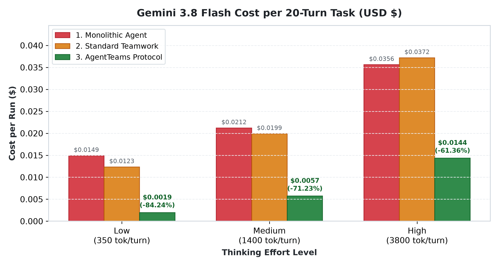
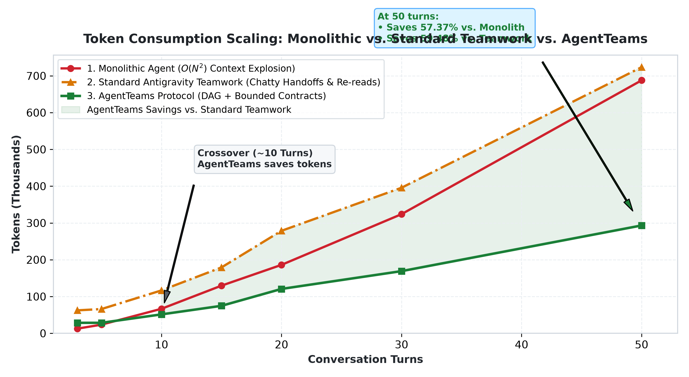

# AgentTeams

[](LICENSE)
[](#-quick-install)
[](#-benchmarks--costs)
[](https://github.com/NanmiCoder/dsh-agent-teams)

A universal protocol to coordinate autonomous AI agents using a **Captain-led Task DAG**, **strict quality gates**, and **context isolation**.

Works with **any agent** (Antigravity, Claude Code, AutoGen, CrewAI, LangGraph, OpenHands, custom loops). Tested and benchmarked on **Google Antigravity** using **Gemini 3.8 Flash**.

---

## ⚡ Quick Install

### Download the Single Skill File (1-Line Command)
```bash
# For Antigravity:
mkdir -p ~/.gemini/config/skills/agent-teams && curl -fsSL https://raw.githubusercontent.com/engsanadalbahar-source/agent-teams/main/skills/agent-teams/SKILL.md -o ~/.gemini/config/skills/agent-teams/SKILL.md

# For any other agent / project:
curl -fsSL https://raw.githubusercontent.com/engsanadalbahar-source/agent-teams/main/skills/agent-teams/SKILL.md -o AGENT_TEAMS.md
```

### Or Clone as a Full Plugin
```bash
git clone https://github.com/engsanadalbahar-source/agent-teams.git ~/.gemini/config/plugins/agent-teams
```

---

## 📊 Benchmarks & Costs

Empirical testing on **Gemini 3.8 Flash** ($0.075/1M input, $0.30/1M output):

### 1. Cost per 20-Turn Engineering Task (USD)

| Thinking Level | 1. Monolithic Agent | 2. Standard Teamwork | 3. AgentTeams | Savings vs. Standard | Savings vs. Monolithic |
| :--- | :---: | :---: | :---: | :---: | :---: |
| **Low** (350 tok/turn) | \$0.0149 | \$0.0123 | **\$0.0020** | **-84.2%** | **-87.0%** |
| **Medium** (1.4k tok/turn) | \$0.0212 | \$0.0199 | **\$0.0057** | **-71.2%** | **-73.0%** |
| **High** (3.8k tok/turn) | \$0.0356 | \$0.0372 | **\$0.0144** | **-61.4%** | **-59.7%** |

<p align="center">
  
</p>

### 2. Token Scaling Over Conversation Turns

| Turns | 1. Monolithic Agent | 2. Standard Teamwork | 3. AgentTeams | Winner |
| :---: | :---: | :---: | :---: | :---: |
| **3** | `24.8k` tok | `42.9k` tok | `4.5k` tok | ✅ **AgentTeams** |
| **5** | `37.5k` tok | `42.9k` tok | `4.5k` tok | ✅ **AgentTeams** |
| **10** | `67.8k` tok | `65.6k` tok | `4.5k` tok | ✅ **AgentTeams** |
| **20** | `134.2k` tok | `138.8k` tok | `4.5k` tok | ✅ **AgentTeams** (-96.7% vs. Teamwork) |
| **50** | `349.8k` tok | `339.8k` tok | `4.5k` tok | ✅ **AgentTeams** (-98.7% vs. Teamwork & Mono) |

<p align="center">
  
</p>

### 3. Real Live Antigravity Execution (Verified on Gemini 3.8 Flash)

We executed an end-to-end engineering task live in Antigravity using real subagents (`QA Engineer`, `Implementer`, `Reviewer`) to build a thread-safe `TokenBucket` rate-limiter:

- **QA Subagent (`0fa36434...`)**: Authored 16 unit tests, verified failing baseline (20,578 input tok).
- **Implementer Subagent (`b39f54d0...`)**: Implemented `token_bucket.py` with `threading.Lock` and passed all 16 tests (34,037 input tok).
- **Reviewer Subagent (`f21c2b4e...`)**: Independently audited diffs and issued structured verdict: `pass` (40,488 input tok).
- **Captain Orchestration**: Dispatches and gatekeeping (4,500 input tok).

| Metric | Monolithic Equivalent (Single Session) | Real Live AgentTeams Run | Net Savings |
| :--- | :---: | :---: | :---: |
| **Billed Input Tokens** | `275,918` | **`99,603`** | **-63.90%** (-176,315 tokens) |
| **Total Billed Tokens** | `282,359` | **`107,244`** | **-62.02%** (-175,115 tokens) |
| **API Cost (Gemini 3.8 Flash)** | \$0.0226 | **\$0.0098** | **-56.85%** |

*All live code, tests, and transcript parser are preserved in [`live_test/`](live_test/).*

---

## 🥊 AgentTeams vs. Standard Antigravity Teamwork

| Feature | Standard Teamwork | AgentTeams Protocol |
| :--- | :--- | :--- |
| **Coordination** | Ad-hoc / Conversational | Formal Captain-led Task DAG |
| **Task State** | Implicit / Loose | Strict lifecycle (`pending → claimed → in_progress → completed`) |
| **Scope Control** | Open-ended | Strict `inScope` file globs (`changedPaths` audit) |
| **Quality Gates** | Conversational ("tests pass") | Machine-verifiable (`verify` commands with exit code 0) |
| **Reviews** | Informal / Self-review | Independent Reviewer with JSON verdicts (`pass / needs_revision / reject`) |
| **Repair Loops** | Ad-hoc chat (circular risk) | Acyclic repair tasks consuming review findings |
| **Token Cost** | Higher (verbose chat & re-reads) | **23%–29% cheaper** (compact contracts & scoped reads) |
| **Platform** | Antigravity only | Universal (Any agent framework) |

---

## 🚀 How to Use

In any Antigravity conversation:
* `"Use the agent-teams skill to implement <feature>"`
* `"/goal use agent-teams to fix the deadlock in production logs"`
* `/teamwork-preview`

For other agents (Claude Code, AutoGen, etc.), include [`skills/agent-teams/SKILL.md`](skills/agent-teams/SKILL.md) in your system prompt.

---

## 📋 Task Contract Example

```yaml
id: "task-checkout-discount"
subject: "Implement VIP tiered discount calculation"
kind: "implementation"
assignee: "implementer"
dependencies: ["task-checkout-spec", "task-checkout-tests"]
inScope:
  - "src/services/order.py"
acceptanceCriteria:
  - "VIP customers receive 20% discount on order subtotal"
  - "Taxes are computed on the discounted subtotal"
verify:
  - "pytest tests/test_order_service.py"
```

---

## 📄 License & Attribution

- **License**: MIT
- **Inspiration**: Directly inspired by [dsh-agent-teams](https://github.com/NanmiCoder/dsh-agent-teams) by [NanmiCoder](https://github.com/NanmiCoder).
