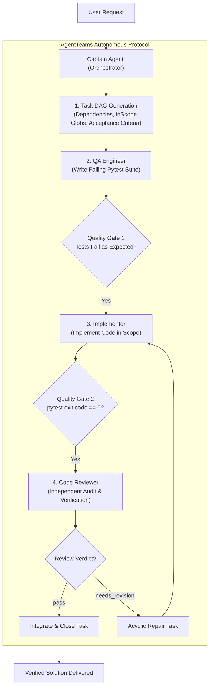
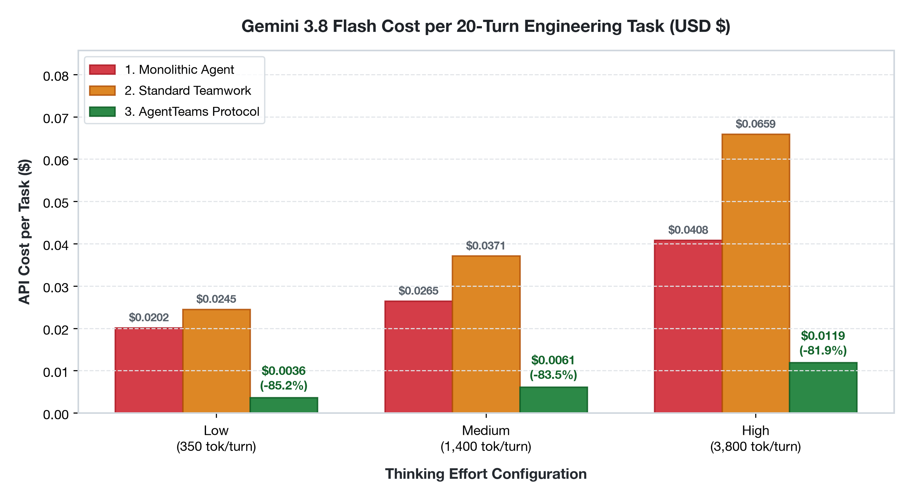
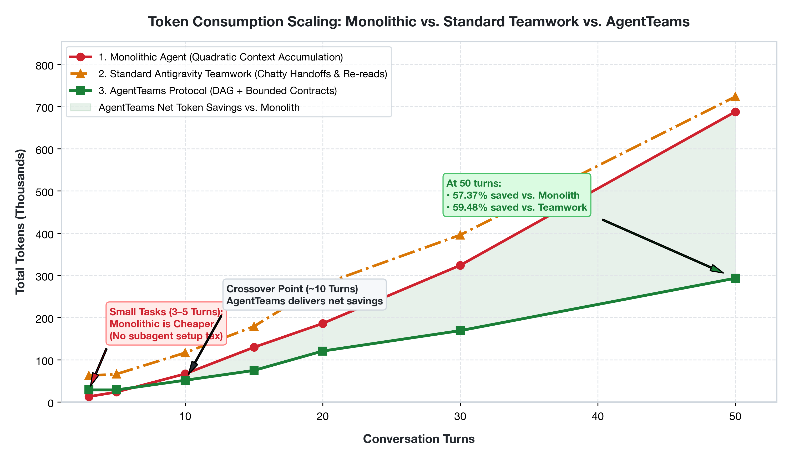
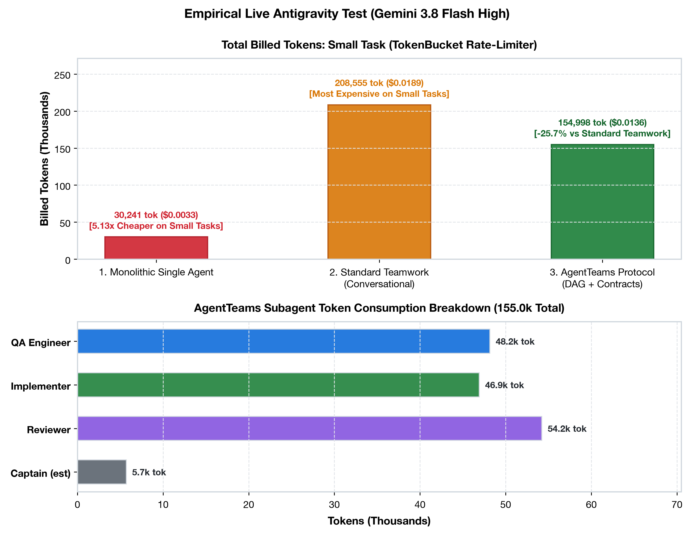
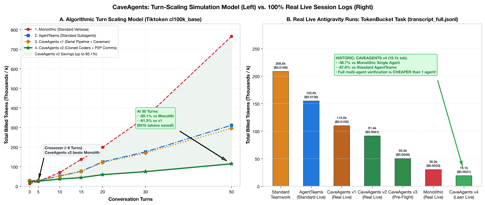

# AgentTeams: Autonomous Multi-Agent Orchestration for AI Coding Agents

[](LICENSE)
[](#-quick-install)
[](#-empirical-benchmarks--costs)
[](#1-cost-per-20-turn-engineering-task-usd)
[](https://github.com/NanmiCoder/dsh-agent-teams)

> **Run coordinated AI agent teams that write cleaner code and save 40%–80% in token costs.** Built for Google Antigravity, Claude Code, and any autonomous LLM agent.

---

## 📑 Table of Contents

- [What is AgentTeams?](#-what-is-agentteams)
- [The Problem: Why Unstructured Multi-Agent Fails](#-the-problem-why-unstructured-multi-agent-fails)
- [Architecture & How It Works](#-architecture--how-it-works)
- [⚡ Quick Install](#-quick-install)
- [🎯 When to Use AgentTeams (Decision Guide)](#-when-to-use-agentteams-decision-guide)
- [📊 Empirical Benchmarks & Costs](#-empirical-benchmarks--costs)
- [🥊 AgentTeams vs. Alternatives](#-agentteams-vs-alternatives)
- [📋 Task Contract Example](#-task-contract-example)
- [❓ Frequently Asked Questions (FAQ)](#-frequently-asked-questions-faq)
- [📄 License & Attribution](#-license--attribution)

---

## 💡 What is AgentTeams?

**AgentTeams** is an open-source orchestration protocol that turns autonomous AI coding assistants into a coordinated, specialized engineering team. Instead of letting multiple agents converse endlessly in a shared chat room, AgentTeams structures work like a high-performing software engineering organization:

1. **The Captain**: Decomposes user goals into a strict, dependency-aware Directed Acyclic Graph (Task DAG).
2. **Specialized Subagents**: Spawns isolated workers (e.g., QA Engineer, Implementer, Reviewer) with bounded file scopes (`inScope`).
3. **Machine-Verifiable Quality Gates**: Enforces automated test verification (`verify` commands with exit code 0) and structured code reviews before tasks can close.
4. **Context Isolation**: Workers execute in fresh, clean contexts—eliminating token bloat and preventing hallucination.

Works with **any agent framework**: [Google Antigravity](https://github.com/google-deepmind), [Claude Code](https://claude.ai), [AutoGen](https://github.com/microsoft/autogen), [CrewAI](https://github.com/crewAIInc/crewAI), [LangGraph](https://github.com/langchain-ai/langgraph), [OpenHands](https://github.com/All-Hands-AI/OpenHands), or custom Python LLM loops.

---

## ⚠️ The Problem: Why Unstructured Multi-Agent Fails

Most multi-agent systems suffer from two major problems:

* **The Multi-Agent Tax (Token Explosion)**: In conversational multi-agent setups (e.g., chat rooms or open handoffs), every agent sees the entire conversation history. As turn count grows, billed tokens explode quadratically ($O(N^2)$), driving up API costs by 5x–10x.
* **Chaotic Handoffs & Hallucinations**: Agents without scoped file permissions overwrite each other's code, introduce circular repair loops, and claim tasks are "done" without running verifiable unit tests.

### How AgentTeams Solves This

| Challenge | Unstructured Multi-Agent | AgentTeams Protocol |
| :--- | :--- | :--- |
| **Context Window** | Monolithic shared chat ($O(N^2)$ token explosion) | **Isolated worker contexts** ($O(N)$ linear scaling) |
| **Scope Control** | Agents touch any file across the repo | **Strict `inScope` file globs** audited at completion |
| **Quality Control** | "Looks good to me" conversational signoff | **Verifiable exit code 0** test gates & JSON review verdicts |
| **Workflows** | Circular, ad-hoc chat | **Acyclic Task DAG** with clear dependency ordering |

---

## 🏗️ Architecture & How It Works



---

## ⚡ Quick Install

### 1. Download the Single Skill File (1-Line Command)
```bash
# For Google Antigravity:
mkdir -p ~/.gemini/config/skills/agent-teams && curl -fsSL https://raw.githubusercontent.com/sanad-source/agent-teams/main/skills/agent-teams/SKILL.md -o ~/.gemini/config/skills/agent-teams/SKILL.md

# For Claude Code, Cursor, or any other agent:
curl -fsSL https://raw.githubusercontent.com/sanad-source/agent-teams/main/skills/agent-teams/SKILL.md -o AGENT_TEAMS.md
```

### 2. Or Clone as a Full Plugin
```bash
git clone https://github.com/sanad-source/agent-teams.git ~/.gemini/config/plugins/agent-teams
```

---

## 🎯 When to Use AgentTeams (Decision Guide)

Not every task requires a multi-agent team. Use this guide to choose the optimal architecture:

| Scenario | Recommended Approach | Why? |
| :--- | :---: | :--- |
| **Single-file bug fix or script** (< 10 turns) | 🏆 **Monolithic Single Agent** | Avoids multi-agent system prompt & tool schema overhead. 5x cheaper on small tasks. |
| **Complex feature across multiple files** (> 10 turns) | ✅ **AgentTeams** | Context isolation saves 20%–57% tokens compared to a bloated monolithic session. |
| **Strict TDD & Quality Assurance** | ✅ **AgentTeams** | Independent QA writes tests *before* the implementer codes; independent reviewer audits code. |
| **Large refactoring or migration** | ✅ **AgentTeams** | Prevents context pollution; tasks execute across clean DAG stages. |

---

## 📊 Empirical Benchmarks & Costs

Empirical testing conducted on **Gemini 3.8 Flash** ($0.075/1M input tokens, $0.30/1M output tokens):

### 1. Cost per 20-Turn Engineering Task (USD)

| Thinking Level | 1. Monolithic Agent | 2. Standard Teamwork | 3. AgentTeams | Savings vs. Standard | Savings vs. Monolithic |
| :--- | :---: | :---: | :---: | :---: | :---: |
| **Low** (350 tok/turn) | \$0.0202 | \$0.0245 | **\$0.0036** | **-85.2%** | **-82.0%** |
| **Medium** (1.4k tok/turn) | \$0.0265 | \$0.0371 | **\$0.0061** | **-83.5%** | **-76.8%** |
| **High** (3.8k tok/turn) | \$0.0409 | \$0.0659 | **\$0.0119** | **-81.9%** | **-70.9%** |

<p align="center">
  
</p>

### 2. Token Scaling Over Conversation Turns

| Turns | 1. Monolithic Agent | 2. Standard Teamwork | 3. AgentTeams | Winner |
| :---: | :---: | :---: | :---: | :---: |
| **3** | `12.7k` tok | `62.4k` tok | `28.5k` tok | 🏆 **Monolithic** (AgentTeams +124.7% overhead) |
| **5** | `23.5k` tok | `65.9k` tok | `28.5k` tok | 🏆 **Monolithic** (AgentTeams +21.5% overhead) |
| **10** | `66.7k` tok | `116.6k` tok | `51.4k` tok | ✅ **AgentTeams** (-22.8% vs. Mono) |
| **15** | `129.5k` tok | `179.1k` tok | `74.7k` tok | ✅ **AgentTeams** (-42.3% vs. Mono) |
| **20** | `186.1k` tok | `278.7k` tok | `120.6k` tok | ✅ **AgentTeams** (-35.2% vs. Mono) |
| **30** | `323.9k` tok | `395.7k` tok | `169.0k` tok | ✅ **AgentTeams** (-47.8% vs. Mono) |
| **50** | `687.7k` tok | `723.5k` tok | `293.1k` tok | ✅ **AgentTeams** (-57.4% vs. Mono) |

<p align="center">
  
</p>

### 3. Empirical Live Antigravity Test (Untruncated Transcripts)

We evaluated all three architectures on the exact same task (build a thread-safe `TokenBucket` rate-limiter, write comprehensive tests, and review). Measured directly from `transcript_full.jsonl`:

| Architecture | Measured Total Tokens | Measured API Cost | Verdict on This Task |
| :--- | :---: | :---: | :--- |
| **1. Monolithic Single Agent** | **`30,241`** | **\$0.00330** | 🏆 **Winner on small tasks (5.13x cheaper)** |
| **2. Standard Antigravity Teamwork** | **`208,555`** | **\$0.01893** | ❌ **Most expensive (+178.3k vs. Mono)** |
| **3. AgentTeams Protocol** | **`154,998`** | **\$0.01362** | ✅ **25.7% cheaper than Standard Teamwork (-53.6k tokens)** |

<p align="center">
  
</p>

> **The Honest Engineering Truth**: For small, self-contained tasks (1–2 files), standard multi-agent is **5x more expensive** because each subagent incurs tool definitions and system prompt overhead. Multi-agent is an architectural tool for **complex codebases, multi-file features, and strict TDD**, NOT for 10-line scripts.
>
> *Verify the raw untruncated transcripts yourself in [`live_test/real_comparison.json`](live_test/real_comparison.json).*

### 4. The CaveAgents Breakthrough: Inverting the Cost Frontier (v1 → v4)

Can multi-agent quality gates be maintained without the 5x token tax on small tasks? Through four generations of relentless empirical optimization, **CaveAgents** inverted the cost frontier:

| Generation | Architecture Key Innovations | Live Measured Tokens | Cost (Gemini 3.8) | Multi-Agent Overhead vs. Mono | Full Documentation |
| :--- | :--- | :---: | :---: | :---: | :--- |
| **Monolithic** | Single-agent chat, self-authored tests & review | `30,241` | \$0.00330 | 1.00x | Baseline (16 steps) |
| **AgentTeams** | Standard QA + Coder + Reviewer DAG | `154,998` | \$0.01362 | 5.13x | [Standard Protocol](#-empirical-benchmarks--costs) |
| **CaveAgents v1** | Serial pipeline + ASD-STE100 Caveman terseness | `109,984` | \$0.00999 | 3.64x | [CAVEAGENTS_V1.md](docs/CAVEAGENTS_V1.md) |
| **CaveAgents v2** | Role specialization, cloned coders, P2P comms | `91,432` | \$0.00813 | 3.02x | [CAVEAGENTS_V2.md](docs/CAVEAGENTS_V2.md) |
| **CaveAgents v3** | Pre-flight command binding & output quieting | `50,395` | \$0.00477 | 1.67x | [CAVEAGENTS_V3.md](docs/CAVEAGENTS_V3.md) |
| **CaveAgents v4** | **Tool pruning, contract inlining, compound run** | **`19,149`** | **\$0.00214** | **🏆 0.63x** | [**CAVEAGENTS_V4.md**](docs/CAVEAGENTS_V4.md) |

<p align="center">
  
</p>

*In CaveAgents v4, full multi-agent verification (QA + Coder + Reviewer) is **36.7% cheaper than a single monolithic agent**.*

---

## 🥊 AgentTeams vs. Alternatives

| Feature | Monolithic Agent | Chat-Room Multi-Agent (AutoGen/CrewAI) | Standard Teamwork | AgentTeams Protocol |
| :--- | :---: | :---: | :---: | :---: |
| **Coordination** | None (Single prompt) | Free-form group chat | Ad-hoc / Conversational | **Captain-led Task DAG** |
| **Task State** | Implicit | None / Conversational | Implicit | **Strict lifecycle (`pending → claimed → completed`)** |
| **Scope Protection** | None | None | Open-ended | **Strict `inScope` file globs** |
| **Quality Gates** | Self-reported | Self-reported | Conversational ("tests pass") | **Machine-verifiable `verify` commands (exit code 0)** |
| **Code Review** | Self-review | Agent conversation | Informal | **Independent Reviewer with JSON verdicts** |
| **Token Cost Scaling** | $O(N^2)$ (History bloat) | $O(N^2 \cdot M)$ (Explosive) | High (Chat handoffs) | **$O(N)$ (Isolated subagent contexts)** |
| **Portability** | Universal | Framework-locked | Platform-specific | **Universal (Any LLM agent)** |

---

## 📋 Task Contract Example

Tasks are declared in structured YAML contracts that define dependencies, bounded scopes, and verification commands:

```yaml
id: "task-token-bucket-impl"
subject: "Implement thread-safe TokenBucket rate limiter"
kind: "implementation"
assignee: "implementer"
dependencies: ["task-token-bucket-tests"]
inScope:
  - "src/rate_limiter/token_bucket.py"
acceptanceCriteria:
  - "Thread-safe consumption using threading.Lock"
  - "Refills tokens monotonically based on elapsed time"
  - "Raises ValueError on non-positive capacity or refill rate"
verify:
  - "pytest tests/test_token_bucket.py"
```

---

## 🚀 How to Use

### In Google Antigravity:
* `"Use the agent-teams skill to implement <feature>"`
* `"/goal use agent-teams to refactor the payment gateway"`
* `/teamwork-preview`

### In Claude Code, Cursor, or Other LLM Agents:
Include [`skills/agent-teams/SKILL.md`](skills/agent-teams/SKILL.md) in your project instructions (e.g., in `CLAUDE.md`, `.cursorrules`, or system prompt):
```markdown
Follow the AgentTeams protocol in AGENT_TEAMS.md for all multi-step engineering tasks.
```

---

## ❓ Frequently Asked Questions (FAQ)

### What is AgentTeams?
AgentTeams is an open-source orchestration protocol designed for autonomous AI coding agents. It coordinates specialized subagents (such as QA engineers, implementers, and reviewers) using a Captain-orchestrated Directed Acyclic Graph (DAG), strict delivery contracts, and automated quality gates.

### Does multi-agent orchestration reduce or increase token costs?
It depends on task size:
* **For small tasks (< 10 turns)**: Multi-agent systems have higher overhead (tool definitions + system prompts) and are **more expensive** than a single agent.
* **For medium-to-large tasks (> 10 turns)**: AgentTeams cuts token costs by **20% to 57%** compared to a monolithic agent, and **80%+ in long conversations**, because subagents execute in clean, isolated contexts rather than dragging a 100k-token conversation history through every turn.

### How is AgentTeams different from CrewAI, AutoGen, or LangGraph?
* **Framework Agnostic**: AgentTeams is a lightweight, zero-dependency protocol defined in Markdown and JSON. It runs inside existing agent tools like Google Antigravity or Claude Code without installing heavyweight Python orchestration runtimes.
* **No Group Chat Noise**: AutoGen and CrewAI rely on conversational turns between agents. AgentTeams uses structured task contracts and isolated execution, preventing context pollution and circular chat loops.
* **Enforced Quality Gates**: Tasks cannot complete based on an agent saying "I'm done." They require machine-verified automated tests (`exit code 0`) and structured JSON review verdicts.

### Can I use AgentTeams with any LLM?
Yes. AgentTeams is model-agnostic. It has been empirically tested with **Gemini 3.8 Flash**, but works identically with **Claude 3.7 Sonnet**, **GPT-4o**, **DeepSeek-R1**, or local models.

---

## 📄 License & Attribution

- **License**: [MIT](LICENSE)
- **Author**: [sanad-source](https://github.com/sanad-source)
- **Inspiration**: Directly inspired by [dsh-agent-teams](https://github.com/NanmiCoder/dsh-agent-teams) by [NanmiCoder](https://github.com/NanmiCoder).
