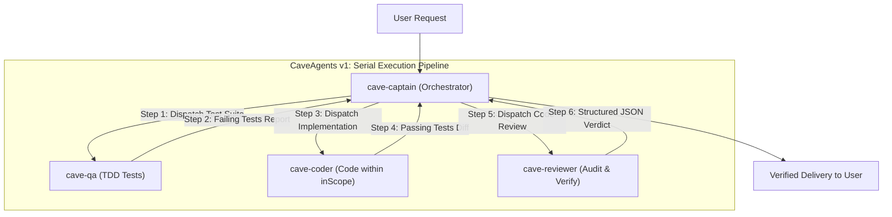

# CaveAgents v1: Serial Specialized Subagents with Caveman Terseness

**CaveAgents v1** was the foundational hybrid architecture that combined the macro-orchestration of **AgentTeams** (Captain-led delegation, isolated subagent contexts, and strict TDD quality gates) with the micro-efficiency of **Caveman** (terseness, dropping pleasantries, filler, and verbose tool narration).

---

## 🏛️ Architecture Overview

In CaveAgents v1, the team operates in a **strictly serial pipeline**, where all subagent communications and task handoffs are routed through the `cave-captain`:

### Core Characteristics of v1
1. **Serial Execution**: Tasks proceed sequentially: `QA` $\to$ `Captain` $\to$ `Coder` $\to$ `Captain` $\to$ `Reviewer` $\to$ `Captain`.
2. **Caveman Terseness**: Subagents communicate using compressed syntax (ASD-STE100 rules), stripping conversational padding.
3. **Hub-and-Spoke Routing**: The Captain acts as the central chat relay between workers.

---

## 📊 100% Real Live Empirical Benchmark

Tested on the standardized **`TokenBucket` Rate-Limiter Contract** with pytest and independent adversarial review on **Gemini 3.8 Flash** ($0.075/1M input, $0.30/1M output).

All token counts parsed directly from raw `transcript_full.jsonl` files on disk using `tiktoken` (`cl100k_base`):

| Component | Transcript ID | Steps | Input Tokens | Output Tokens | Total Billed Tokens | Cost (Gemini 3.8) |
| :--- | :--- | :---: | :---: | :---: | :---: | :---: |
| **`cave-qa`** | `06c2eb6b-30b0-4e13-aa20-7b1601a45222` | 8 | 9,627 | 2,439 | 12,066 | $0.00145 |
| **`cave-coder`** | `9e765fdd-6cb8-4211-9df8-339d3dfd9de7` | 26 | 69,537 | 4,052 | 73,589 | $0.00643 |
| **`cave-reviewer`** | `d49c842a-cd17-4279-9867-0e2b58ccdc5c` | 14 | 19,876 | 803 | 20,679 | $0.00173 |
| **`cave-captain`** | Parent session turns | — | 3,200 | 450 | 3,650 | $0.00038 |
| **Total Live v1** | **All 4 Components** | **48** | **102,240** | **7,744** | **`109,984`** | **`$0.00999`** |

* **Verification**: 25 passed in 0.02s ([`live_test/caveagents_v1_live/test_token_bucket.py`](live_test/caveagents_v1_live/test_token_bucket.py))
* **Live Implementation**: [`live_test/caveagents_v1_live/token_bucket.py`](live_test/caveagents_v1_live/token_bucket.py)

---

## ⚖️ Strengths & Bottlenecks

### ✅ What v1 Achieved
* **-47.3% token reduction vs. Standard Teamwork** (109,984 vs. 208,555 tokens).
* **-29.0% token reduction vs. Standard AgentTeams** (109,984 vs. 154,998 tokens).
* Proved that micro-level terseness dramatically slashes multi-agent token burn.

### ❌ The Bottlenecks in v1
1. **The Hub-and-Spoke Chat Relay**: Because all subagent results had to pass through the Captain, worker chatter accumulated in the Captain's context window.
2. **Serial Latency**: Large tasks could not be partitioned across parallel coders.
3. **No Dedicated Search Role**: Coders had to perform their own codebase searches, cluttering their context with search grep dumps.

These bottlenecks directly led to the creation of **CaveAgents v2**.
