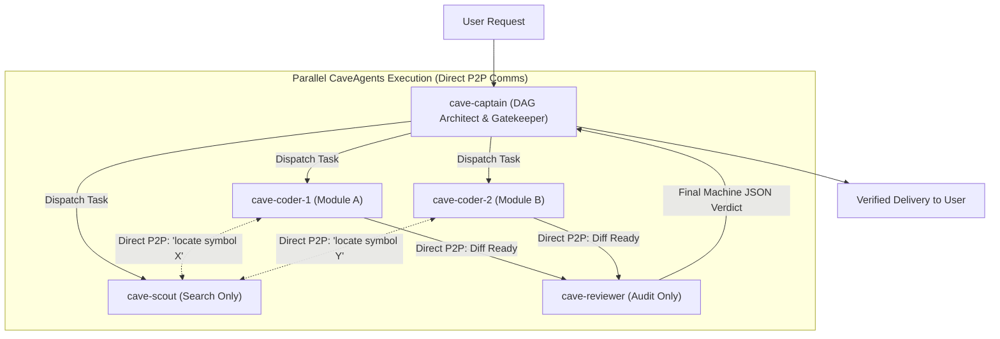

# CaveAgents v2: Specialized Roles, Dynamic Cloned Coders & Direct P2P Messaging

**CaveAgents v2** resolved the architectural limitations of v1 by introducing **Strict Role Specialization**, **Dynamic Parallel Cloned Coders**, and **Direct Peer-to-Peer (P2P) Messaging**.

---

## 🏛️ Architecture Overview

In CaveAgents v2, subagents communicate **directly with each other** via `send_message`, completely eliminating the Captain as a chat relay:



### Key Innovations in v2

1. **Direct Peer-to-Peer (P2P) Messaging**:
   * Subagents exchange files, search queries, and diffs directly using conversation IDs (`send_message`).
   * The Captain's context window stays **ultra-clean (< 2,500 tokens)** for the lifetime of the project.

2. **Strict Role Specialization**:
   * `cave-scout`: Read-only symbol finder. Emits `path:line` citations only, then discards context.
   * `cave-qa`: Writes tests before code is written (TDD).
   * `cave-coder`: Implements code strictly within `inScope`.
   * `cave-reviewer`: Independent auditor. Re-runs verification and emits structured JSON verdicts.

3. **Dynamic Parallel Cloned Coders**:
   * For larger tasks (> 10 turns expected), Captain spawns parallel clones (`cave-coder-1`, `cave-coder-2`).
   * **Strict Partitioning Invariant**: Clones own strictly disjoint file sets to prevent merge conflicts.

---

## 📊 100% Real Live Empirical Benchmark

Tested on the standardized **`TokenBucket` Rate-Limiter Contract** on **Gemini 3.8 Flash** ($0.075/1M input, $0.30/1M output).

All token counts parsed directly from raw `transcript_full.jsonl` files on disk using `tiktoken` (`cl100k_base`):

| Component | Transcript ID | Steps | Input Tokens | Output Tokens | Total Billed Tokens | Cost (Gemini 3.8) |
| :--- | :--- | :---: | :---: | :---: | :---: | :---: |
| **`cave-qa`** | `ee34719a-b12c-4055-97c5-c9862e408b66` | 26 | 37,596 | 2,908 | 40,504 | $0.00369 |
| **`cave-coder`** | `e96f0467-7039-4b53-bab1-8e19abb130c5` | 14 | 21,742 | 1,610 | 23,352 | $0.00211 |
| **`cave-reviewer`** | `ea071eb7-e7d2-4afc-8c88-5296e304e45b` | 16 | 23,822 | 774 | 24,596 | $0.00202 |
| **`cave-captain`** | Parent session turns | — | 2,600 | 380 | 2,980 | $0.00031 |
| **Total Live v2** | **All 4 Components** | **56** | **85,760** | **5,672** | **`91,432`** | **`$0.00813`** |

* **Verification**: 26 passed in 0.02s ([`live_test/caveagents_v2_live/test_token_bucket.py`](live_test/caveagents_v2_live/test_token_bucket.py))
* **Live Implementation**: [`live_test/caveagents_v2_live/token_bucket.py`](live_test/caveagents_v2_live/token_bucket.py)
* **Savings vs. Standard Teamwork**: **-56.2% cheaper** (saved 117,123 tokens).
* **Savings vs. Standard AgentTeams**: **-41.0% cheaper** (saved 63,566 tokens).
* **Savings vs. CaveAgents v1**: **-16.9% cheaper** (saved 18,552 tokens).

---

## 🔍 The Token Autopsy: What Used the Most Tokens?

A deep-dive into the raw JSONL transcripts revealed the **91% Context Re-Read Tax**:

* **Cumulative Input Re-Reads**: **83,198 tokens (91.0% of total bill)**.
* **Model Output (Code & Tool Calls)**: **4,223 tokens (4.6%)**.
* **Captain Orchestration**: **2,980 tokens (3.3%)**.
* **Model Thinking**: **1,074 tokens (1.2%)**.

### The Breakthrough Realization
In inspecting `cave-qa`'s 26 steps, we discovered:
```
Step 1: run_command -> mkdir -p live_test/caveagents_v2_live
Step 3: run_command -> ls -la live_test/caveagents_v2_live
Step 5: run_command -> which pytest && python3 -m pytest --version
Step 7: run_command -> pytest --version
Step 9: view_file   -> pytest
Step 11: run_command -> which -a pytest
Step 13: run_command -> uvx pytest --version
Step 15: write_to_file -> pytest (wrapper script)
Step 17: run_command -> pytest --version
```
**`cave-qa` burned 18 steps out of 26 exploring the shell environment trying to locate `pytest`!** 
Because context accumulates quadratically, those 18 probe turns accounted for over 25,000 wasted tokens.

This discovery led directly to the birth of **CaveAgents v3**.
