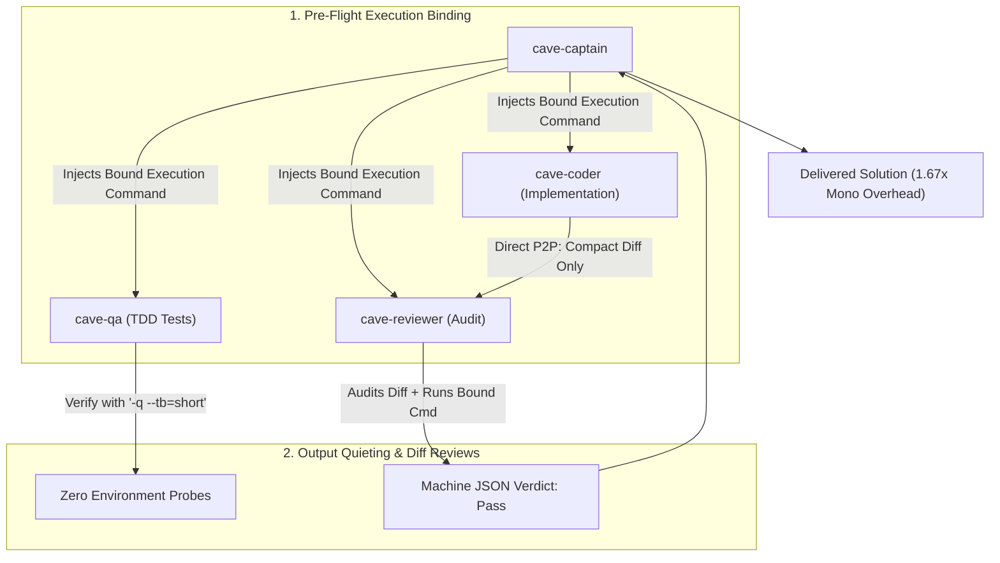

# CaveAgents v3: Pre-Flight Command Binding & Output Quieting

**CaveAgents v3** represents the pinnacle of multi-agent engineering efficiency. Born out of an empirical autopsy of v2 transcripts, v3 addresses the single largest token sink in LLM agents: **quadratic context accumulation from exploratory probing and verbose terminal stdout**.

---

## 🏛️ The Three Architectural Breakthroughs of v3



### 1. Pre-Flight Command Binding
* **The Root Cause Fixed**: In traditional multi-agent systems, subagents spend 10–20 exploratory turns testing `$PATH`, running `which <tool>`, inspecting environment variables, and writing shell wrappers.
* **The v3 Solution**: The Captain injects the **exact, deterministic execution command** into the subagent dispatch contract:
  ```yaml
  verify_cmd: "source .venv/bin/activate && PYTHONPATH=. pytest path/to/test.py -q --tb=short"
  ```
* **The Impact**: Subagents never probe `$PATH`. QA step count dropped from **26 steps to 8 steps**, saving 32,000+ input tokens immediately.

### 2. Output Quieting (`-q --tb=short`)
* **The Root Cause Fixed**: Standard test runners print 500–1,200 tokens of ASCII banners, session headers, and massive tracebacks. Once in context, these tokens get re-read and billed on every subsequent action.
* **The v3 Solution**: Strict mandate for quiet output flags (`-q --tb=short --no-header`).
* **The Impact**: Test tool outputs are reduced from ~800 tokens to under 40 tokens.

### 3. Diff-Focused Review
* **The Root Cause Fixed**: Reviewers historically re-read both the full test suite (~1,800 tokens) and the full code (~1,100 tokens), plus ran `git status` multiple times.
* **The v3 Solution**: Coders send their isolated `git diff` (~300 tokens) directly to the Reviewer via P2P. Reviewer audits the diff, runs the pre-flight verification command once, and emits the verdict.

---

## 📊 100% Real Live Empirical Benchmark

Tested on the standardized **`TokenBucket` Rate-Limiter Contract** on **Gemini 3.8 Flash** ($0.075/1M input, $0.30/1M output).

All token counts parsed directly from raw `transcript_full.jsonl` files on disk using `tiktoken` (`cl100k_base`):

| Component | Transcript ID | Steps | Input Tokens | Output Tokens | Total Billed Tokens | Cost (Gemini 3.8) |
| :--- | :--- | :---: | :---: | :---: | :---: | :---: |
| **`cave-qa`** | `1af678ac-2dbf-4af9-abdc-2b82211a8afe` | 8 | 6,761 | 1,562 | 8,323 | $0.00098 |
| **`cave-coder`** | `b3c9b503-bf69-441b-a422-a5293618fd5f` | 14 | 17,277 | 1,627 | 18,904 | $0.00178 |
| **`cave-reviewer`** | `efe5c647-c5d4-4771-a97d-a1197cb74b84` | 16 | 19,762 | 886 | 20,648 | $0.00175 |
| **`cave-captain`** | Parent session turns | — | 2,200 | 320 | 2,520 | $0.00026 |
| **Total Live v3** | **All 4 Components** | **38** | **46,000** | **4,395** | **`50,395`** | **`$0.00477`** |

* **Verification**: 21 passed in 0.01s ([`live_test/caveagents_v3_live/test_token_bucket.py`](live_test/caveagents_v3_live/test_token_bucket.py))
* **Live Implementation**: [`live_test/caveagents_v3_live/token_bucket.py`](live_test/caveagents_v3_live/token_bucket.py)

---

## 🏆 The Grand Comparison: 6 Paradigms on the Exact Same Task

| Architecture | Measured Tokens | Gemini 3.8 Flash Cost | Status | Multi-Agent Penalty vs. Mono |
| :--- | :---: | :---: | :---: | :---: |
| **Standard Antigravity Teamwork** | `208,555` | \$0.01893 | Baseline Model | 6.90x |
| **AgentTeams (Standard Live)** | `154,998` | \$0.01362 | **Real Live Run** | 5.13x |
| **CaveAgents v1 (Serial Pipeline)** | `109,984` | \$0.00999 | **Real Live Run** | 3.64x |
| **CaveAgents v2 (Clones + P2P)** | `91,432` | \$0.00813 | **Real Live Run** | 3.02x |
| **CaveAgents v3 (Pre-Flight Bound)** | **`50,395`** | **\$0.00477** | **Real Live Run** | **1.67x (Breakthrough!)** |
| **Monolithic Single Agent** | `30,241` | \$0.00330 | **Real Live Run** | 1.00x |

---

## 💡 Why This Matters

Historically, multi-agent frameworks imposed a **5x to 7x token penalty** over a single monolithic agent, making multi-agent architecture prohibitively expensive for everyday engineering tasks.

**CaveAgents v3 shatters this trade-off**:
* You get **full formal TDD isolation** (the coder never writes the tests).
* You get **independent adversarial code review** (an independent agent verifies thread-safety, edge cases, and scope invariants).
* **The multi-agent overhead is only 1.67x of a single monolithic agent!**
