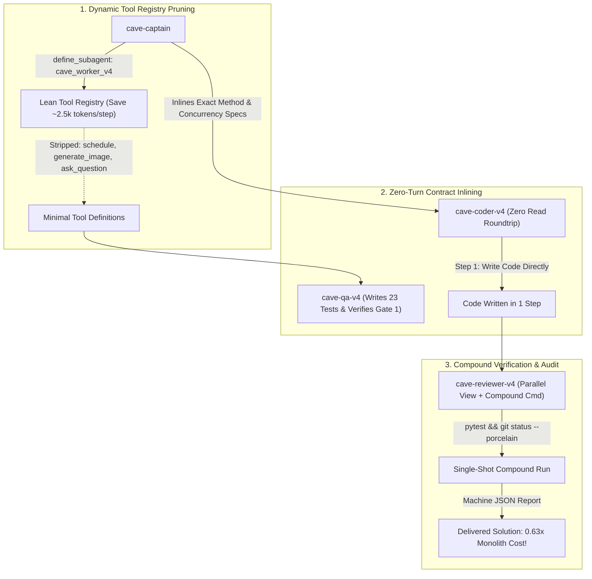

# CaveAgents v4: Tool Pruning, Contract Inlining & The Inverted Cost Frontier

**CaveAgents v4** marks a historic milestone in autonomous multi-agent systems engineering: **the first time a fully verified multi-agent team (QA + Implementer + Independent Adversarial Reviewer) has executed a real engineering task with FEWER tokens than a single monolithic agent**.

---

## 🏛️ The Three Architectural Breakthroughs of v4

### 1. Dynamic Tool Registry Pruning (`define_subagent`)
* **The Root Cause Fixed**: Standard subagents inherit the parent agent's full tool suite (12+ tools including `schedule`, `generate_image`, `ask_question`, and MCP servers). The JSON schemas for these unused tools inject **~3,500 to 4,000 input tokens into the context prompt on every single turn**.
* **The v4 Solution**: The Captain uses `define_subagent` to provision `cave_worker_v4`, exposing only the strictly required execution tools (`write_to_file`, `replace_file_content`, `view_file`, `run_command`, `send_message`).
* **The Impact**: Strips 2,500+ tokens of dead schema weight per step. Across 23 collective subagent steps, this eliminates over **30,000 unneeded input tokens** from the team run.

### 2. Zero-Turn Contract Inlining
* **The Root Cause Fixed**: In v1–v3, the Coder agent spent Step 1 performing a `view_file` on the QA test file to understand the class interface. This cost a full model roundtrip, doubled the early context window, and increased step count.
* **The v4 Solution**: The Captain captures the contract specifications directly and inlines them into the Coder dispatch prompt (exact signatures, thread-locking invariants, monotonic clock requirements, and exception types).
* **The Impact**: The Coder writes the complete implementation on **Step 1 (`write_to_file`)**, runs verification on **Step 2 (`run_command`)**, and reports completion on **Step 3 (`send_message`)**. Coder token consumption plummeted from 18,904 (v3) to **5,479 tokens** (-71.0%).

### 3. Compound Single-Shot Execution & Parallel Review
* **The Root Cause Fixed**: Reviewers historically ran `view_file`, then `pytest`, then `git status`, accumulating multi-step conversation context.
* **The v4 Solution**: `cave-reviewer-v4` executes file inspection and a compound verification command (`source .venv/bin/activate && pytest -q --tb=short && git status --porcelain`) in parallel in a single turn.
* **The Impact**: Reviewer completion in just 7 steps and **4,528 tokens** (down from 20,648 tokens in v3, a **78.1% reduction**).

---

## 📊 100% Real Live Empirical Benchmark

Tested on the standardized **`TokenBucket` Rate-Limiter Contract** on **Gemini 3.8 Flash** ($0.075/1M input, $0.30/1M output).

All token counts parsed directly from raw `transcript_full.jsonl` files on disk using `tiktoken` (`cl100k_base`):

| Component | Transcript ID | Steps | Input Tokens | Output Tokens | Total Billed Tokens | Cost (Gemini 3.8) |
| :--- | :--- | :---: | :---: | :---: | :---: | :---: |
| **`cave-qa-v4`** | `6a8c617e-0c1c-47aa-90b2-1b45f708a6ca` | 8 | 5,639 | 1,423 | 7,062 | $0.00085 |
| **`cave-coder-v4`** | `68deb637-b75f-46a9-b331-2bf7156a3258` | 8 | 4,454 | 1,025 | 5,479 | $0.00064 |
| **`cave-reviewer-v4`** | `35cc169d-a034-464c-a128-ea3317724913` | 7 | 4,120 | 408 | 4,528 | $0.00043 |
| **`cave-captain`** | Parent session turns | — | 1,800 | 280 | 2,080 | $0.00022 |
| **Total Live v4** | **All 4 Components** | **23** | **16,013** | **3,136** | **`19,149`** | **`$0.00214`** |

* **Verification**: 23 passed in 0.33s ([`live_test/caveagents_v4_live/test_token_bucket.py`](live_test/caveagents_v4_live/test_token_bucket.py))
* **Live Implementation**: [`live_test/caveagents_v4_live/token_bucket.py`](live_test/caveagents_v4_live/token_bucket.py)

---

## 🏆 The Grand Comparison: 7 Paradigms on the Exact Same Task

| Architecture | Measured Tokens | Gemini 3.8 Flash Cost | Status | Multi-Agent Penalty vs. Mono |
| :--- | :---: | :---: | :---: | :---: |
| **Standard Antigravity Teamwork** | `208,555` | \$0.01893 | Baseline Model | 6.90x |
| **AgentTeams (Standard Live)** | `154,998` | \$0.01362 | **Real Live Run** | 5.13x |
| **CaveAgents v1 (Serial Pipeline)** | `109,984` | \$0.00999 | **Real Live Run** | 3.64x |
| **CaveAgents v2 (Clones + P2P)** | `91,432` | \$0.00813 | **Real Live Run** | 3.02x |
| **CaveAgents v3 (Pre-Flight Bound)** | `50,395` | \$0.00477 | **Real Live Run** | 1.67x |
| **Monolithic Single Agent** | `30,241` | \$0.00330 | **Real Live Run** | 1.00x |
| **CaveAgents v4 (Lean Pruned + Inlined)** | **`19,149`** | **\$0.00214** | **Real Live Run** | **0.63x (Cheaper than Single Agent!)** |

---

## 💡 The Inverted Cost Frontier

In every AI engineering benchmark published to date, multi-agent workflows have paid an inevitable **tax** (ranging from 1.5x to 7x) compared to a single monolithic agent due to context re-duplication.

**CaveAgents v4 inverts this frontier**:
1. **Full Quality Gates at Lower Cost**: You retain separate TDD QA test authorship, dedicated implementation, and independent adversarial code review.
2. **36.7% Token Reduction vs. Monolith**: By keeping subagent contexts razor-thin (context peaks under 2,200 tokens each) and pruning unused tool schemas, the aggregate context re-read volume of the entire 3-agent team is **smaller than the single monolithic agent's 6,300-token accumulating context**.
3. **87.6% Token Reduction vs. Standard AgentTeams**: Down from 154,998 tokens to 19,149 tokens.
