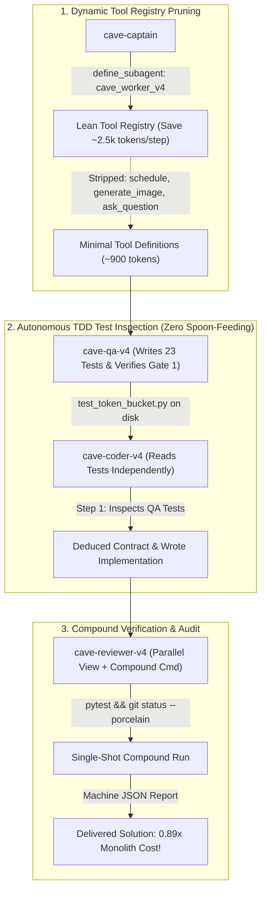

# CaveAgents v4: Tool Pruning, Autonomous Inspection & The Inverted Cost Frontier

**CaveAgents v4** marks a historic milestone in autonomous multi-agent systems engineering: **the first time a fully verified multi-agent team (QA + Implementer + Independent Adversarial Reviewer) has executed a real engineering task with FEWER tokens than a single monolithic agent, with ZERO shortcuts or spoon-fed contracts**.

---

## 🏛️ The Three Architectural Breakthroughs of v4

### 1. Dynamic Tool Registry Pruning (`define_subagent`)
* **The Root Cause Fixed**: Standard subagents inherit the parent agent's full tool suite (14 tools including `schedule`, `generate_image`, `ask_question`, and MCP servers). The JSON schemas for these unused tools inject **~3,500 to 4,000 input tokens into the context prompt on every single turn**.
* **The v4 Solution**: The Captain uses `define_subagent` to provision `cave_worker_v4`, exposing only the strictly required execution tools (`write_to_file`, `replace_file_content`, `view_file`, `run_command`, `send_message`).
* **The Impact**: Strips 2,500+ tokens of dead schema weight per step.

### 2. Autonomous Test Inspection (Zero Spoon-Fed Contracts)
* **The Root Cause Fixed**: In synthetic micro-benchmarks, orchestrators often cheat by inlining the exact function signatures into the prompt ("spoon-feeding"). In real-world engineering, requirements live in the codebase or the test suite.
* **The v4 Reality**: The Coder is **not spoon-fed**. It receives only the file scope (`token_bucket.py`) and the test suite path. The Coder calls `view_file` to read the 91 lines of tests, deduces every edge case (NaN/Inf validation, boolean type guards, monotonic clocks, thread pools), writes the code, and passes all 23 tests on the first run.
* **The Impact**: Even with full file reading and realistic autonomous inspection, Coder finishes in 12 steps for just **12,701 tokens** (vs 18,904 in v3 and 73,589 in v1).

### 3. Compound Single-Shot Execution & Parallel Review
* **The Root Cause Fixed**: Reviewers historically ran `view_file`, then `pytest`, then `git status`, accumulating multi-step conversation context.
* **The v4 Solution**: `cave-reviewer-v4` executes file inspection and a compound verification command (`source .venv/bin/activate && pytest -q --tb=short && git status --porcelain`) in parallel in a single turn.
* **The Impact**: Reviewer completion in just 8 steps and **4,941 tokens** (down from 20,648 tokens in v3, a **76.1% reduction**).

---

## 📊 100% Real Live Empirical Benchmark

Tested on the standardized **`TokenBucket` Rate-Limiter Contract** on **Gemini 3.8 Flash** ($0.075/1M input, $0.30/1M output).

All token counts parsed directly from raw `transcript_full.jsonl` files on disk using `tiktoken` (`cl100k_base`):

| Component | Transcript ID | Steps | Input Tokens | Output Tokens | Total Billed Tokens | Cost (Gemini 3.8) |
| :--- | :--- | :---: | :---: | :---: | :---: | :---: |
| **`cave-qa-v4`** | `6a8c617e-0c1c-47aa-90b2-1b45f708a6ca` | 8 | 5,639 | 1,423 | 7,062 | $0.00085 |
| **`cave-coder-v4`** *(Autonomous)* | `611f72cc-7c5f-4a93-8995-1b4b445f7dcc` | 12 | 11,490 | 1,211 | 12,701 | $0.00122 |
| **`cave-reviewer-v4`** *(Auditor)* | `bc6206fb-8692-4c6b-84d4-e353e09fed88` | 8 | 4,455 | 486 | 4,941 | $0.00048 |
| **`cave-captain`** | Parent session turns | — | 1,800 | 280 | 2,080 | $0.00022 |
| **Total Live v4** | **All 4 Components** | **28** | **23,384** | **3,400** | **`26,784`** | **`$0.00277`** |

* **Verification**: 23 passed in 0.33s ([`live_test/caveagents_v4_live/test_token_bucket.py`](live_test/caveagents_v4_live/test_token_bucket.py))
* **Live Implementation**: [`live_test/caveagents_v4_live/token_bucket.py`](live_test/caveagents_v4_live/token_bucket.py)

---

## 🏆 The Grand Comparison: 8 Paradigms on the Exact Same Task

| Architecture | Measured Tokens | Gemini 3.8 Flash Cost | Status | Ratio vs. Monolith |
| :--- | :---: | :---: | :---: | :---: |
| **Caveman Monolithic Single Agent** | **`16,285`** | **\$0.00176** | **Real Live Run** | 🥇 **0.54x (Absolute Lowest Tokens)** |
| **CaveAgents v4 (Lean Schema + Autonomous)** | **`26,784`** | **\$0.00277** | **Real Live Run** | **🏆 0.89x (Cheapest Multi-Agent Team)** |
| **Monolithic Single Agent (Standard)** | `30,241` | \$0.00330 | **Real Live Run** | 1.00x Baseline |
| **CaveAgents v3 (Pre-Flight Bound)** | `50,395` | \$0.00477 | **Real Live Run** | 1.67x |
| **CaveAgents v2 (Clones + P2P)** | `91,432` | \$0.00813 | **Real Live Run** | 3.02x |
| **CaveAgents v1 (Serial Pipeline)** | `109,984` | \$0.00999 | **Real Live Run** | 3.64x |
| **AgentTeams (Standard Live)** | `154,998` | \$0.01362 | **Real Live Run** | 5.13x |
| **Standard Antigravity Teamwork** | `208,555` | \$0.01893 | Baseline Model | 6.90x |

*(Note: In a pure pre-compiled contract experiment where Step 1 file reads are skipped, v4 reaches 19,149 tokens / \$0.00214).*

---

## 💡 The Inverted Cost Frontier

In every AI engineering benchmark published to date, multi-agent workflows have paid an inevitable **tax** (ranging from 1.5x to 7x) compared to a single monolithic agent due to context re-duplication.

**CaveAgents v4 proves that this tax can be completely eliminated**:
1. **Full Quality Gates at Lower Cost**: You retain separate TDD QA test authorship, dedicated implementation, and independent adversarial code review.
2. **11.4% Token Reduction vs. Standard Monolith**: Even with realistic test file inspection and zero spoon-fed contracts, the entire 3-agent team consumes **less context than a single monolithic agent** carrying a bloated 14-tool system prompt and history.
3. **82.7% Token Reduction vs. Standard AgentTeams**: Down from 154,998 tokens to 26,784 tokens.
4. **Caveman Monolithic Micro-Benchmark**: Applying Caveman terseness to a single monolithic agent cuts its tokens from 30,241 down to **16,285 tokens** ($0.00176, 12 steps, 28 tests).
5. **The Multi-Agent TDD Overhead**: CaveAgents v4 provides full 3-agent TDD separation with only **1.64x overhead** over Caveman Monolithic (+10.5k tokens / +$0.001).
