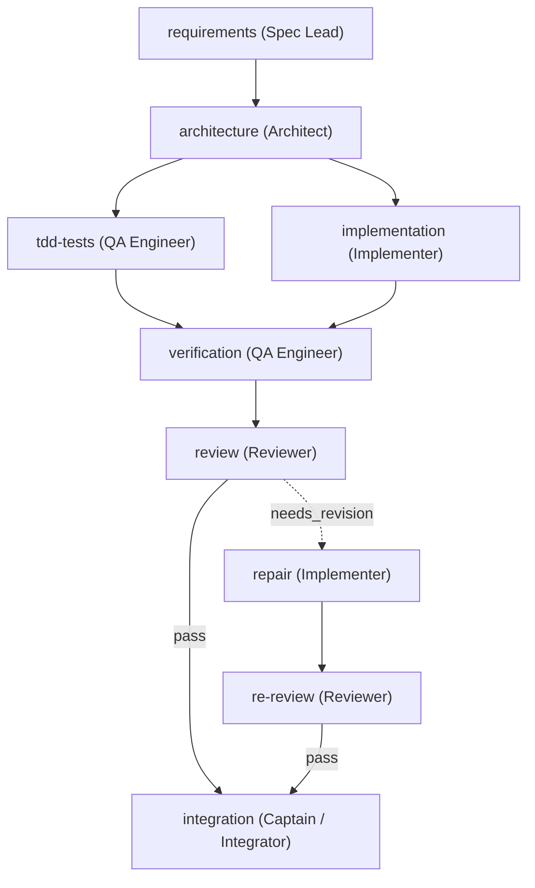

# AgentTeams: Multi-Agent Team Orchestration Skill

The **AgentTeams** skill transforms Antigravity from a single-threaded coding assistant into a **Captain** orchestrating a coordinated, specialized team of autonomous subagents.

Inspired by the [dsh-agent-teams](https://github.com/NanmiCoder/dsh-agent-teams) protocol, this skill enforces structured delegation, clean separation of concerns, dependency-aware task graphs (DAGs), direct peer-to-peer agent messaging, and machine-verifiable **Quality Gates** (requirements → implementation → verification → review → repair → integration).

---

## How to Call / Activate This Skill

You can activate this skill in any of the following ways:

### 1. Explicit Skill Invocation (Recommended)
Mention the skill name directly in your request or slash command:
- `"Use the agent-teams skill to implement <feature>"`
- `"/goal use agent-teams to refactor <module>"`
- `"Activate agent-teams: build <system> with a full review cycle"`

### 2. Natural Language Request
Ask for a team-based or multi-agent execution:
- `"Assemble an agent team to design, code, and test this"`
- `"Coordinate a multi-agent workflow with QA and independent review"`
- `"Use subagents as a team with a task DAG to build <feature>"`

### 3. Teamwork Slash Command
Trigger teamwork planning via slash command:
- `/teamwork-preview`

---

## 1. Core Principles

1. **Strict Model Inheritance**:
   - **All agents and subagents MUST use `Model: 'inherit'`.**
   - This ensures every subagent in the team strictly runs on whichever model the user has selected in the interface (e.g. Gemini 3.8 Flash, or any model selected by the user), never silently diverging to other models.

2. **Captain-Led Delegation**:
   - The primary Antigravity session acts as the **Captain**.
   - The Captain plans the roster, designs the task DAG, delegates tasks, resolves conflicts, and consolidates the final delivery.
   - The Captain does not write bulk implementation code if specialized workers exist; it focuses on orchestration, gatekeeping, and synthesis.

3. **Durable Specialized Subagents**:
   - Workers are invoked as durable subagents via `invoke_subagent` with tailored roles and workspaces (`inherit`, `branch`, `share`), always with `Model: 'inherit'`.
   - Workers retain context for their specific domain, preventing context bloat and distraction in the primary conversation.

4. **Plan Before Execution (Staged Roster & DAG)**:
   - Before launching subagents, the Captain drafts a structured team roster and task dependency graph.
   - In planning mode, this is presented to the user via `implementation_plan.md` for review and approval.

5. **Dependency-Aware Task DAG**:
   - Tasks follow an explicit lifecycle: `pending → claimed → in_progress → completed | failed | cancelled`.
   - A task cannot be claimed until **all** its upstream dependencies reach `completed`.
   - `failed` or `cancelled` upstream tasks **never** silently unlock downstream work.

6. **Structured Quality Gates & Delivery Contracts**:
   - No task is finished simply by an agent asserting "it looks good".
   - Tasks must satisfy structured contracts: explicit acceptance criteria, in-scope file bounds (`inScope`), passing test commands (`verify`), and independent review verdicts (`pass`, `needs_revision`, `reject`).
   - Failed reviews trigger independent `repair` and `re-review` tasks without creating circular dependencies.

7. **Direct Peer-to-Peer Messaging**:
   - Team members communicate directly via `send_message` using recipient conversation IDs without routing every clarification through the Captain.

---

## 2. Standard Team Roster & Role Matrix

Every subagent uses `Model: 'inherit'` to guarantee it runs on the user's chosen model:

| Role | Responsibilities | Model | Tool Access |
| :--- | :--- | :--- | :--- |
| **Captain** | Team assembly, DAG management, user communication, final integration review | `inherit` (User model) | Full access |
| **Spec / Analyst** | Requirements elicitation, user scenarios, edge cases, acceptance criteria definition | `inherit` (User model) | Read-only / Research |
| **Architect** | Interface design, API schemas, dependency contracts, structural invariants | `inherit` (User model) | Read-only / Docs |
| **Implementer** | TDD code implementation, strictly confined to `inScope` files | `inherit` (User model) | Full write / Command |
| **Tester / QA** | Test suite implementation, edge-case coverage, executing test commands | `inherit` (User model) | Full write / Command |
| **Reviewer** | Independent audit of diffs, security, style, and correctness; issues structured verdicts | `inherit` (User model) | Read-only / Research |
| **Integrator** | Build verification, conflict resolution, changelog, and packaging | `inherit` (User model) | Full write / Command |

---

## 3. Team Profiles (Pre-Configured Workflows)

### Profile A: `software-delivery` (Standard Feature Delivery)
Use for standard features, full-stack components, or significant refactors:


### Profile B: `bug-hunt-and-repair` (Root Cause & Fix)
Use for diagnosing regressions, debugging tricky bugs, or security patches:
1. **reproduction** (Tester): Write a failing regression test reproducing the exact failure.
2. **root-cause-analysis** (Analyst / Implementer): Pinpoint the origin with grep/view.
3. **minimal-patch** (Implementer): Apply minimal, non-invasive fix within strictly defined scope.
4. **regression-verify** (Tester): Ensure new regression test passes and no existing suites break.
5. **review** (Reviewer): Validate fix correctness, edge cases, and ensure no side-effects.

### Profile C: `deep-refactor` (Structural Modernization)
Use for large refactoring, migrations, or architectural restructuring:
1. **safety-baseline** (QA): Snapshot existing test suite and verify 100% green baseline.
2. **contract-spec** (Architect): Document invariant interfaces and backwards compatibility.
3. **modular-refactor** (Implementers in parallel): Refactor decoupled packages/modules.
4. **contract-verify** (QA): Run full integration test suite.
5. **independent-review** (Reviewer): High-severity review focusing on regressions and performance.

---

## 4. Task State Machine & DAG Engine

### 4.1 State Transitions
```
  [ pending ]
       │  (All upstream dependencies completed)
       ▼
  [ claimed ]
       │  (Worker starts execution)
       ▼
 [ in_progress ]
       ├──▶ [ completed ]  ──▶ (Unlocks downstream tasks)
       ├──▶ [ failed ]     ──▶ (Blocks downstream; triggers repair/halt)
       └──▶ [ cancelled ]  ──▶ (Task abandoned or superseded)
```

### 4.2 State Invariants
- **Monotonic Attempt Tracking**: Every task run carries an `attempt` counter and an `attempt_id`. If a task is reassigned or retried, increment `attempt` and generate a new `attempt_id`. Stale workers writing to an old `attempt_id` must be ignored.
- **Dependency Invariant**: A task can transition to `claimed` **only** if:
  $$\forall d \in \text{dependencies}, \quad \text{state}(d) == \text{completed}$$
- **Atomic Reassignment**: To reassign a stalled worker, the Captain marks the existing attempt abandoned, notifies or terminates the old worker (`manage_subagents` with `kill` if needed), and increments the attempt before dispatching to the new worker.

---

## 5. Structured Quality Gates & Contracts

Quality is enforced through machine-verifiable task specifications rather than conversational agreement:

### 5.1 The Task Contract Schema
Every task in the DAG must define:
```yaml
id: "task-id"
subject: "Clear operational summary"
kind: "requirements" | "implementation" | "verification" | "review" | "repair" | "integration"
assignee: "role-name"
dependencies: ["upstream-task-id"]
inScope:
  - "path/to/allowed/directory/**"
  - "path/to/specific/file.ts"
acceptanceCriteria:
  - "Criterion 1: Concrete measurable behavior"
  - "Criterion 2: Expected return value or status"
verify:
  - "npm test -- tests/target.spec.ts"
  - "npm run typecheck"
```

### 5.2 Verdicts and Findings Schema (Review Tasks)
The Reviewer subagent must output a structured verdict:
- **`verdict`**: `pass` | `needs_revision` | `reject`
- **`findings`**: Array of issues:
  * `severity`: `blocker` | `high` | `medium` | `low`
  * `file`: Target file path
  * `line`: Target line number or range
  * `description`: Exact description of the defect or regression
  * `remediation`: Specific suggested fix

### 5.3 Automated Repair Loops
When a review task concludes with `needs_revision`:
1. The review task finishes with status `failed` (or records verdict in output).
2. The Captain automatically spawns a `repair-round-N` task assigned to the Implementer.
3. **Critical Invariant**: The repair task does **NOT** depend on the failed review task; it depends on the original implementation and consumes the review's `findings`.
4. A corresponding `review-round-(N+1)` task is created depending on `repair-round-N`.

### 5.4 Scope Audit (`changedPaths`)
Upon task completion, the Captain or Integrator audits modified files:
- Run `git status --short` or inspect tool actions.
- Verify all modified files match the task's `inScope` glob patterns.
- If an agent touched unauthorized files (e.g., unintended edits to config files or unrelated modules), reject the attempt and request a reversion.

---

## 6. Antigravity Execution Runbook

When orchestrating an AgentTeam in Antigravity:

### Step 1: Evaluate & Assemble
Assess the user request. If it involves complex multi-component architecture, large refactors, or strict quality requirements:
- Determine the appropriate team profile (`software-delivery`, `bug-hunt-and-repair`, or custom).
- Ensure all subagents are configured with `Model: 'inherit'`.

### Step 2: Plan & Stage DAG
- In Planning Mode, document the roster, task contracts, and dependency diagram in `implementation_plan.md`.
- Ensure all tasks have explicit acceptance criteria, `inScope` paths, and `verify` commands.
- Obtain user approval before spawning workers.

### Step 3: Dispatch & Subagent Lifecycle
- Call `invoke_subagent` to spawn team members:
  * Specify clear `Role`, `Prompt`, and `Model: 'inherit'`.
  * Use `Workspace: 'share'` or `'inherit'` to share repository access, or `'branch'` for isolated experimental spikes.
- Note the returned `conversationId` for each subagent.

### Step 4: Manage Coordination & Mailboxes
- Use `send_message` to dispatch ready tasks and pass upstream context to assignees:
  ```json
  {
    "Recipient": "<member-conversation-id>",
    "Message": "Task claimed: [T4-implementation]. Requirements contract: {...}. Upstream interfaces: {...}. Proceed strictly within inScope paths."
  }
  ```
- Allow subagents to collaborate by sharing conversation IDs so peer-to-peer handoffs happen directly.

### Step 5: Enforce Quality Gates & Audits
- When QA or Reviewers complete, verify that test logs show passing exit codes.
- Inspect diffs against `inScope` boundaries.
- If review fails, dispatch a targeted repair task with explicit findings.

### Step 6: Consolidate & Finalize
- After all DAG tasks reach `completed` and the final integration review passes:
  * Run full project build and test suite.
  * Generate a comprehensive `walkthrough.md` documenting what each member delivered, test verifications, and architectural summary.
  * Report completion clearly to the user.
