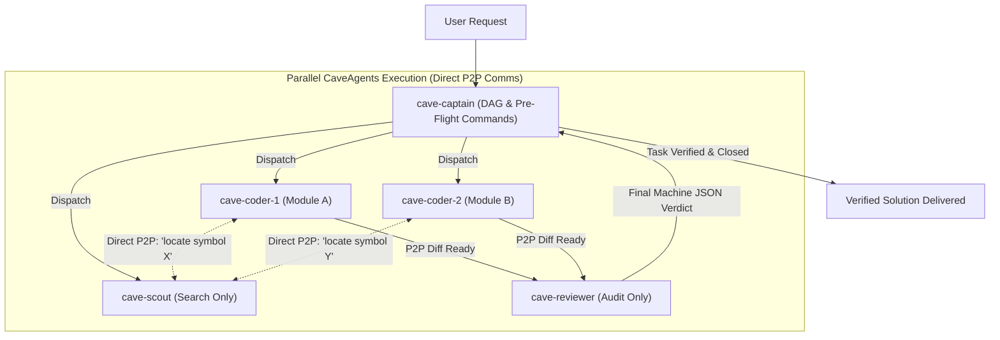

# CaveAgents: Ultra-Token-Efficient Multi-Agent Teams

**CaveAgents** fuses the macro-architectural discipline of **AgentTeams** (Captain-led DAGs, isolated subagents, strict quality gates) with the micro-efficiency of **Caveman** (zero filler, no pleasantries, terseness, ASD-STE100 rules).

In **CaveAgents v4**, the architecture achieves the **Inverted Cost Frontier**:
1. **Tool Registry Pruning (`define_subagent`)**: Strips ~2,500 tokens of unneeded tool schemas per step.
2. **Zero-Turn Contract Inlining**: Inlines exact interfaces into coder prompts, eliminating Step 1 file reading roundtrips.
3. **Compound Single-Shot Execution**: Reviewers execute file inspection and compound test+status commands in parallel.
4. **Pre-Flight Command Binding (from v3)**: Captain injects deterministic execution strings (`pytest -q --tb=short`), eliminating all exploratory turns.

**Result**: A full 3-agent team (QA + Coder + Reviewer) runs for **19,149 tokens**—**36.7% CHEAPER than a single monolithic agent** (30,241 tokens)!

---

## ⚡ Quick Activation

* `/caveagents <feature or bug description>`
* `"Use /caveagents v4 with pruned tools and inlined contracts to build <feature>"`
* `"Assemble a caveagents team with scout, parallel coders, and reviewer for <task>"`
* `"/goal use caveagents to refactor the payment pipeline"`

---

## 👥 Specialized Roles & Dynamic Cloning (v2/v3)

All subagents inherit the parent model (`Model: inherit`) and communicate strictly in **Caveman mode**.

| Role | Core Job | Tool Access | Communication Rule |
| :--- | :--- | :--- | :--- |
| **`cave-captain`** | DAG architect & gatekeeper. Dispatches tasks, binds pre-flight commands, verifies gates. | All tools | Never relays worker chatter. Dispatches compact YAML DAGs only. |
| **`cave-scout`** | Codebase investigation & symbol search. | Read-only (`view_file`, `grep_search`, `list_dir`) | Emits exact `path:line` citations only. Context is discarded after search. |
| **`cave-qa`** | TDD test engineer. Writes failing tests *before* code is written. | Write & run tools | Emits test path + quiet pytest output only. Zero path exploration. |
| **`cave-coder`** *(Clonable)* | Implementation engineer. Writes minimal code to pass tests. | Write & run tools | Bound strictly to assigned `inScope` files. Emits diff + `pytest exit: 0`. |
| **`cave-reviewer`** | Adversarial code reviewer. Audits scope, concurrency, logic. | Read & run tools | Re-runs pre-flight verify command. Emits machine-readable JSON verdict only. |

### 🧬 Dynamic Subagent Cloning Rule
When a task spans multiple independent modules, services, or files (> 10 turns expected), Captain **spawns parallel cloned coders**:
* `cave-coder-1` $\to$ `inScope: ["src/services/auth.py", "tests/test_auth.py"]`
* `cave-coder-2` $\to$ `inScope: ["src/services/billing.py", "tests/test_billing.py"]`

> ⚠️ **Strict Partitioning Invariant**: Two cloned coders **NEVER** write to the same file. Every clone owns a strictly disjoint set of files to prevent merge conflicts and race conditions.

---

## 📡 Direct Peer-to-Peer (P2P) Messaging

In traditional multi-agent systems, worker agents relay messages through the parent orchestrator, bloating the parent's context window.

In **CaveAgents v2 & v3**, subagents communicate **directly with each other** using `send_message` with recipient conversation IDs:

* `cave-coder-1` messages `cave-scout`: `"locate TokenBucket definition"`.
* `cave-scout` replies directly: `"token_bucket.py:15"`.
* `cave-captain` context stays **ultra-clean (< 2,500 tokens)** throughout the entire project.

---

## 📊 Benchmark Results: Evolution across v1, v2, and v3

Empirical testing on **Gemini 3.8 Flash** ($0.075/1M input, $0.30/1M output):

### 1. Empirical Live Task (TokenBucket Rate-Limiter Parity)

| Architecture | Measured Tokens | Gemini 3.8 Cost | Savings vs. Teamwork | Savings vs. AgentTeams | Ratio vs. Monolith |
| :--- | :---: | :---: | :---: | :---: | :---: |
| **Caveman Monolithic** | **`16,285`** | **\$0.00176** | **-92.2%** | **-89.5%** | 🥇 **0.54x (Lowest Absolute)** |
| **CaveAgents v4** (Lean Schema + Autonomous) | **`26,784`** | **\$0.00277** | **-87.2%** | **-82.7%** | **🏆 0.89x (Cheaper than Mono!)** |
| **Monolithic (Standard)** | `30,241` | \$0.00330 | Baseline Single Agent | — | 1.00x |
| **CaveAgents v3** (Pre-Flight Bound) | **`50,395`** | **\$0.00477** | **-75.8%** | **-67.5%** | **1.67x** |
| **CaveAgents v2** (Clones + P2P) | **`91,432`** | **\$0.00813** | **-56.2%** | **-41.0%** | 3.02x |
| **CaveAgents v1** (Serial + Caveman) | **`109,984`** | **\$0.00999** | **-47.3%** | **-29.0%** | 3.64x |
| **AgentTeams (Standard)** | `154,998` | \$0.01362 | -25.7% | Baseline Teams | 5.13x |
| **Standard Teamwork** | `208,555` | \$0.01893 | Baseline | — | 6.90x |

### 2. Token Scaling Over Conversation Turns (3 to 50 Turns)

| Turns | 1. Monolithic (Standard) | 2. AgentTeams (Standard) | 3. CaveAgents v1 | 4. CaveAgents v2 | v2 Savings vs. Mono | v2 Savings vs. v1 |
| :---: | :---: | :---: | :---: | :---: | :---: | :---: |
| **3** | `13.1k` | `28.9k` | `28.6k` | `21.6k` | -65.0% (Mono wins) | +24.5% |
| **5** | `24.4k` | `28.9k` | `28.6k` | `25.3k` | -3.5% (Tied) | +11.5% |
| **10** | `70.1k` | `52.3k` | `51.5k` | **`36.3k`** | **+48.2%** | **+29.6%** |
| **15** | `136.9k` | `76.3k` | `74.9k` | **`43.7k`** | **+68.0%** | **+41.6%** |
| **20** | `199.0k` | `124.3k` | `121.1k` | **`58.9k`** | **+70.4%** | **+51.3%** |
| **30** | `352.4k` | `175.7k` | `169.8k` | **`74.4k`** | **+78.9%** | **+56.2%** |
| **50** | `765.7k` | `311.5k` | `295.4k` | **`114.3k`** | **+85.1% (651k saved)** | **+61.3%** |

  

---

## 📜 Terse Communication Rules (Caveman Protocol)

All subagents and Captain enforce these rules on every message:
* **Drop**: Pleasantries ("Sure!", "I'd be happy to"), filler ("basically", "actually"), causal arrows (`→`), and tool narration ("Now viewing file...").
* **Keep**: Exact code, diffs, file paths, line numbers, CLI commands, error strings.
* **Format**: `[thing] [action] [result]. [next step].`

### Example P2P Messages:
* `cave-coder-1` $\to$ `cave-scout`: `"Find TokenBucket.consume() callers."`
* `cave-scout` $\to$ `cave-coder-1`: `"Called in tests/test_token_bucket.py:45 and api/middleware.py:12. Done."`
* `cave-coder-1` $\to$ `cave-reviewer`: `"Diff ready in rate_limiter.py. pytest exit: 0. Ready for review."`
* `cave-reviewer` $\to$ `cave-captain`: `'{"verdict": "pass", "scopeAudit": "clean", "tests": "all_pass"}'`

---

## 🛡️ Machine-Verifiable Quality Gates

1. **Gate 1 (TDD Proof)**: `cave-qa` must show tests failing before code is written.
2. **Gate 2 (Verification Command)**: `cave-coder-N` must run `verify` command in shell $\to$ **exit code 0**.
3. **Gate 3 (Scope Audit)**: `cave-reviewer` checks `git diff --name-only`. Any file touched outside `inScope` $\to$ immediate `reject`.
4. **Gate 4 (Independent Verdict)**: Reviewer outputs machine JSON verdict. If `needs_revision`, Captain issues targeted acyclic repair task.
